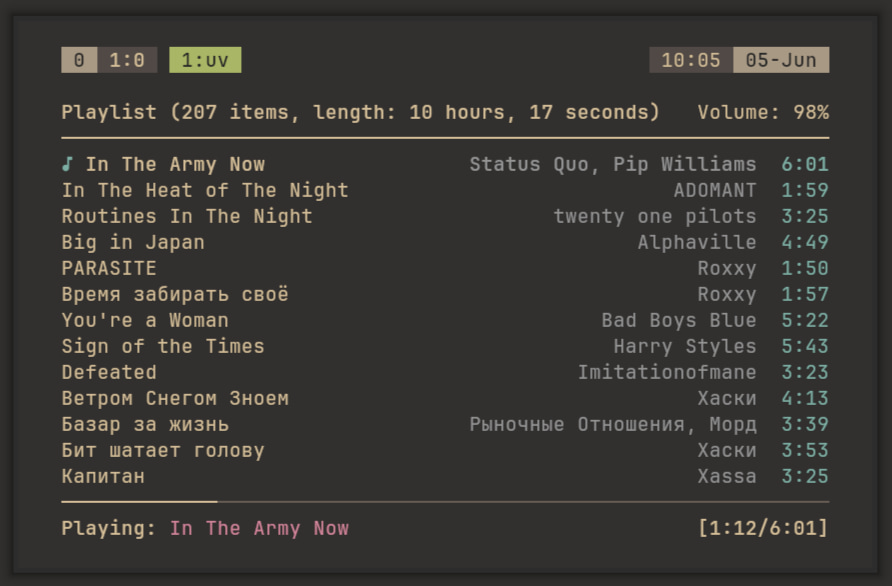

# yandex-music-cli



Minimalist CLI manager for Yandex Music utilizing MPD (Music Player Daemon) and ncmpcpp.

## Features
* Synchronization of liked tracks to local storage.
* ID3 tagging (Title, Artist, Album, Year, Track number) and embedding album covers (400x400).
* Track sequence retention matching the original cloud order.
* Automatic cleanup of unliked tracks on sync.
* Total MPD integration and lightweight command-line routing.

## Requirements
* `uv` (Fast Python package and project manager)
* `mpd` & `mpc`
* `ncmpcpp` (Optional, for TUI interface)

Python dependencies (`yandex-music`, `mutagen`) are declared inline in `downloader.py`
and resolved automatically by `uv` on first run — no manual install required.

## Installation & Setup

1. **Install uv:**

Ensure `uv` is installed on your system (e.g., `yay -S uv` on Arch Linux).

2. **Clone the repository:**

```bash
mkdir -p ~/.config/scripts && cd $_
git clone https://github.com/diominvd/yandex-music-cli.git yandex-music
cd yandex-music
```

3. **Authentication:**

* Obtain your Yandex Music token using the [yandex-music-token](https://github.com/MarshalX/yandex-music-token) extension.
* Create a token file and paste your token inside:

```bash
mkdir -p ~/.config/scripts/yandex-music
echo "YOUR_TOKEN_HERE" > ~/.config/scripts/yandex-music/token
```

4. **Paths Verification:**

MPD must expose a UNIX socket. Add the following line to `~/.config/mpd/mpd.conf`:

```
bind_to_address "~/.local/share/mpd/socket"
```

To make `mpc` and `ncmpcpp` aware of this socket, export the `MPD_HOST` variable in your shell configuration file (e.g., `~/.zshrc` or `~/.zshenv`):

```
export MPD_HOST="$HOME/.local/share/mpd/socket"
```

If your socket lives elsewhere, update both files accordingly.

## Usage

Create a symlink or an alias to `manager.py` (e.g., named `music`) and run:

```bash
music [ COMMAND ]
```

### Daemon
| Command | Description |
| --- | --- |
| `--start` | Start the MPD user service. |
| `--stop` | Stop the MPD user service. |
| `--restart` | Restart the MPD user service. |
| `--status` | Show the MPD service status. |

### Library
| Command | Description |
| --- | --- |
| `--update` | Run the sync engine: download new likes, delete unliked tracks, rescan the database. |
| `--scan` | Rescan the MPD database without syncing. |
| `--init` | Rebuild the MPD queue in chronological order of your likes and launch `ncmpcpp`. |
| `--clear` | Stop playback and clear the queue. |

### Playback
| Command | Description |
| --- | --- |
| `--current` | Print the currently playing track. |
| `--play` | Resume playback. |
| `--pause` | Pause playback. |
| `--next` | Skip to the next track. |
| `--prev` | Return to the previous track. |
| `--shuffle` | Shuffle the current queue. |
| `--random` | Toggle random mode on/off. |

## File Layout

All state lives under `~/.config/scripts/yandex-music/`, downloaded audio under `~/Music/yandex/`.

```
~/.config/scripts/yandex-music/
├── manager.py
├── downloader.py
├── token
└── state.json
```

| Path | Description |
| --- | --- |
| `manager.py` | CLI entry point and MPD command router. |
| `downloader.py` | Sync engine (download, tag, prune). |
| `token` | Your Yandex Music API token (plain text, gitignored). |
| `state.json` | Source of truth mapping track IDs to their order index and filename. |

### state.json

`state.json` records the cloud order of your likes (`{ "ids": { "<id>": { "index": int, "file": str } } }`).
It drives chronological queue rebuilding in `--init` and lets `--update` detect unliked tracks for removal.
If sync state ever gets out of sync, delete this file and run `--update` to rebuild it from scratch.
